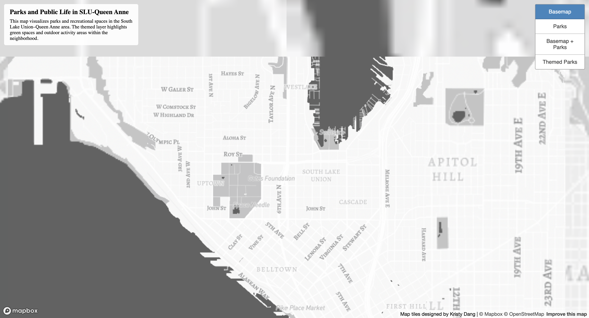
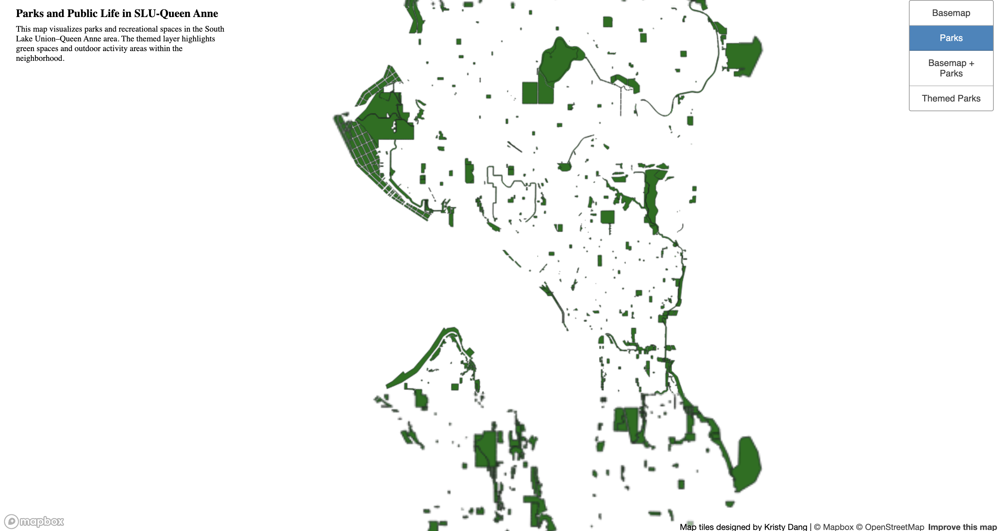
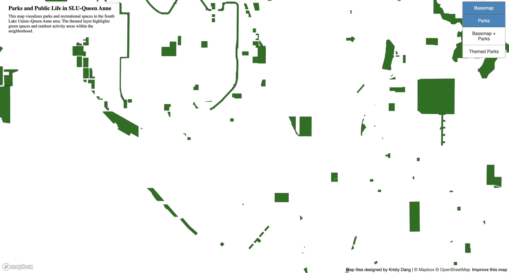
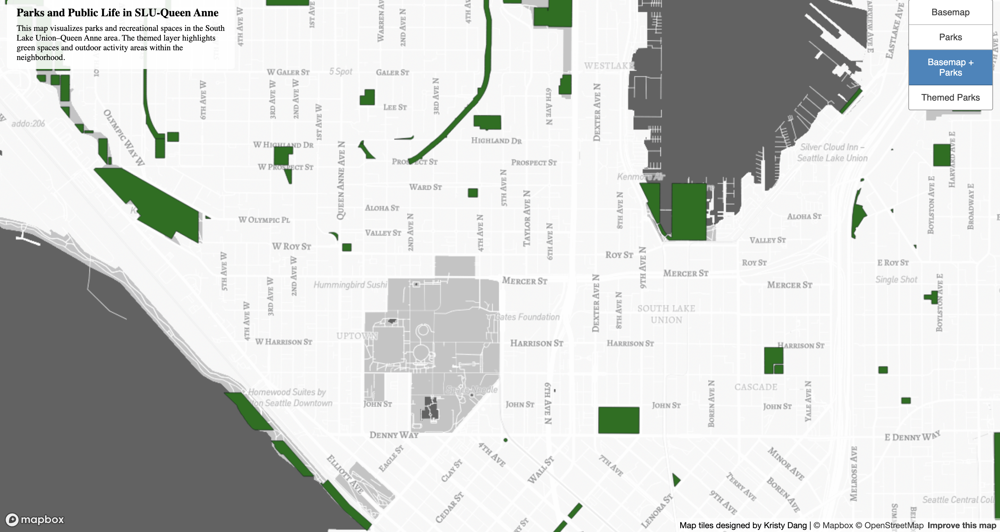
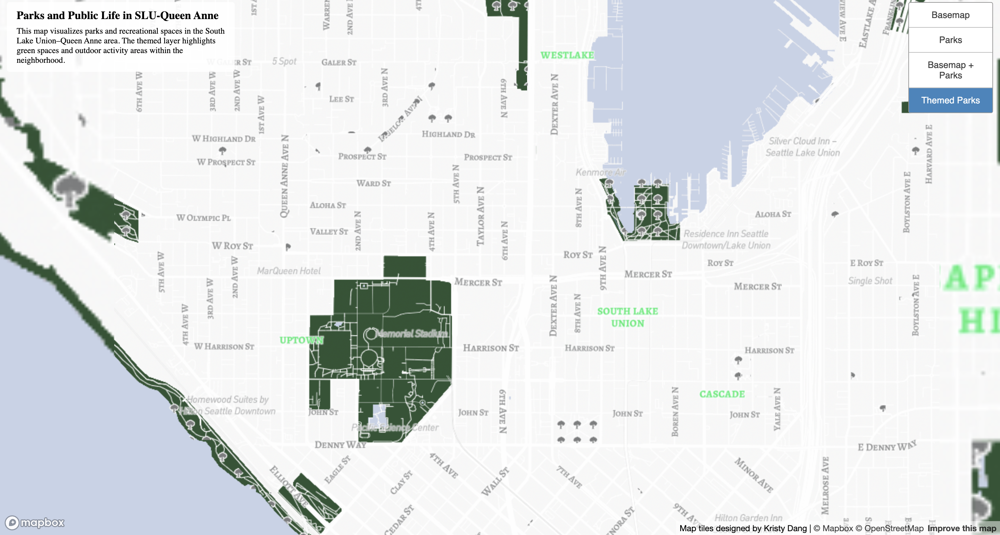

# Tilesets Lab

## Web Map URL
https://kridang.github.io/tilesets/index.html

---

## Lab Work

### Tileset 1

**Geographic Area Examined**
United States (continental U.S.), with a focus on Queen Anne and South Lake union area, which will be later used for the other tileset examinations.

**Available Zoom Levels**
Zoom levels 0–14.

**Description**
This tileset provides a broad overview of geographic features across the United States. It is designed to be visible at lower zoom levels and offers spatial context for the rest of the map layers.

---

### Tileset 2

**Geographic Area Examined**
Seattle, with a focus on Queen Anne and South Lake union area

**Available Zoom Levels**
Zoom levels 9–15.

**Description**
This tileset highlights parks and green spaces within Seattle. The features become more detailed at mid to higher zoom levels, where users can see clearer park boundaries in the specified area.

---

### Tileset 3

**Geographic Area Examined**
Seattle, with a focus on Queen Anne and South Lake union area

**Available Zoom Levels**
Zoom levels 10–15.

**Description**
This tileset displays both the basemap and park boundaries, where users can visualize the distribution of green space in an urban environment

---

### Tileset 4

**Geographic Area Examined**
Queen Anne and South Lake union area.

**Available Zoom Levels**
Zoom levels 11–15.

**Description**
This tileset focuses on a local neighborhood area and allows for higher zoom levels. Despite their close proximity, South Lake Union and Queen Anne have different demographics and characteristics, with South Lake Union being more tech-oriented and fast-paced, while Queen Anne reflects a more residential and slower-paced environment. I wanted to learn more about this area for this reason. The theme of this tileset is Nature.